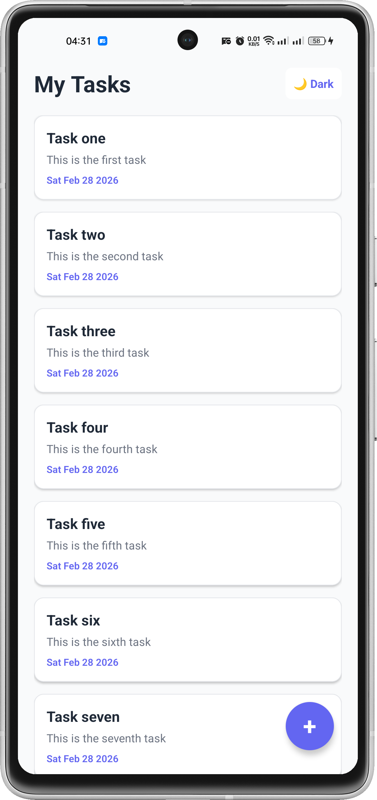
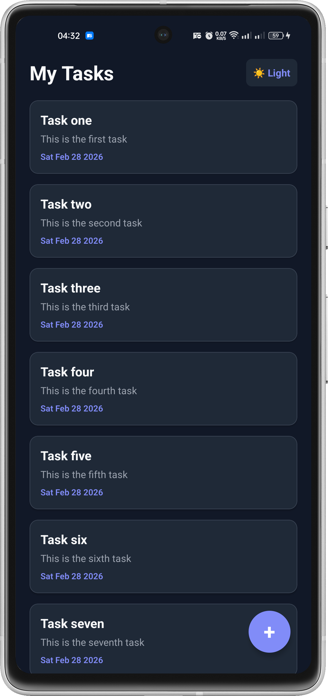
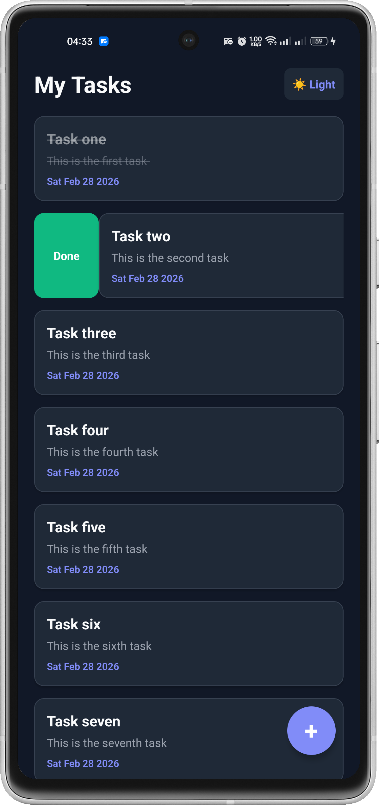
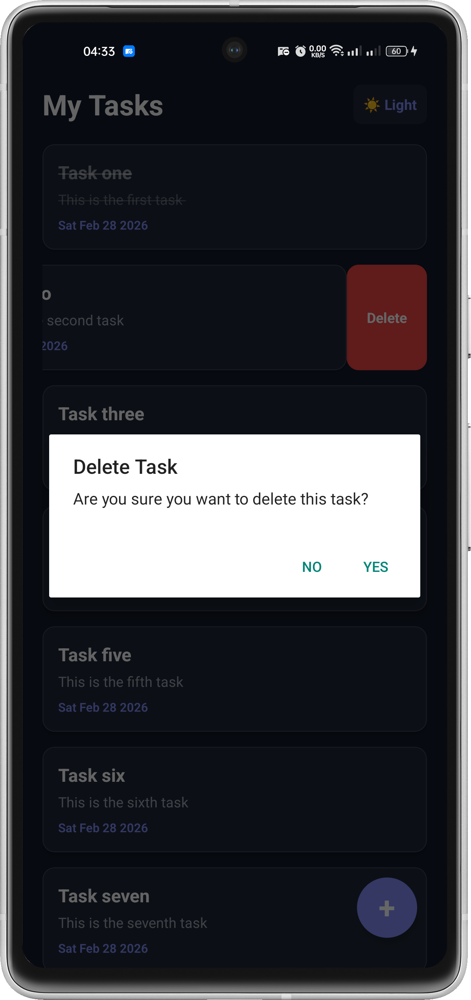
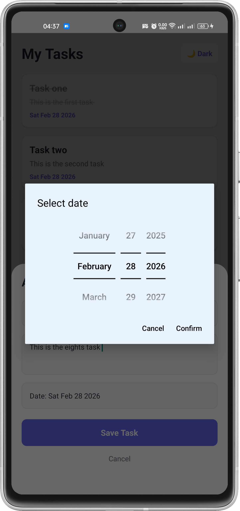
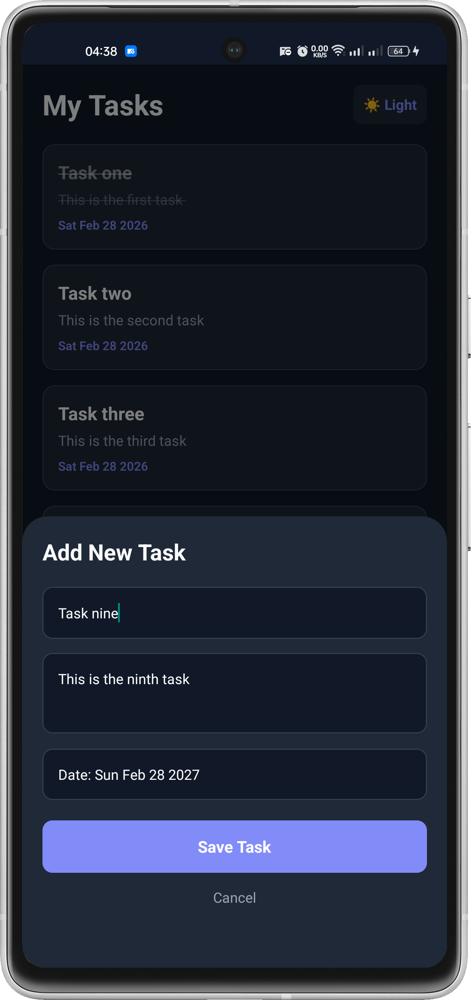
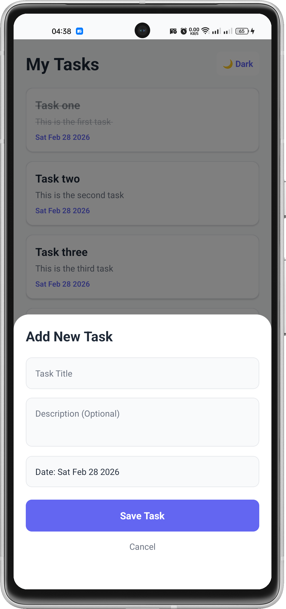

# Pro Task Manager

A modern, robust, and feature-rich to‑do list application built with **React Native CLI** and **TypeScript**. Pro Task Manager focuses on delivering a seamless user experience with interactive swipe gestures, dynamic theming, and reliable local data persistence.

---

## Features

### Dynamic Theming

- Smooth toggle between **Light** and **Dark** modes.
- Implemented using the **React Context API** for global theme management.
- Centralized, strongly typed color system for consistent UI across the app.

### Interactive Gestures (Swipeable)

Powered by **`react-native-gesture-handler`**:

- **Swipe Left** → Delete a task  
  - Displays a native confirmation alert to prevent accidental deletions.
- **Swipe Right** → Toggle task status  
  - Switch between:
    - **Done** (Green)
    - **Pending / Undo** (Orange)
  - UI updates dynamically (text, colors, and status indicators).

### Modern UI and UX

- **Floating Action Button (FAB)** for quick task creation.
- **Interactive Bottom Sheet / Modal**:
  - Clean, focused interface for entering task details.
  - Smooth animations and intuitive layout.
- Thoughtful spacing and typography for better readability.

### Smart Date Integration

- Native date selection powered by **`react-native-date-picker`**.
- Assign deadlines and due dates to tasks.
- Deadlines are displayed alongside tasks for better planning.

### Local Data Persistence

- Tasks are stored locally on the device using **`@react-native-async-storage/async-storage`** (v1.23.1 for maximum stability).
- All tasks, statuses, and deadlines persist between sessions.
- No backend required; works completely offline.

### Safe Area and Device Compatibility

- Seamless rendering on devices with **notches**, **punch holes**, and **dynamic islands**.
- Implemented via **`react-native-safe-area-context`** for consistent padding and layout behavior across platforms.

---

## Tech Stack

- **Framework:** React Native CLI (no Expo)
- **Language:** TypeScript
- **Core Libraries and Tools:**
  - **State Management:** React Hooks (`useState`, `useEffect`, `useContext`)
  - **Local Storage:** `@react-native-async-storage/async-storage`
  - **Gestures and Interactions:** `react-native-gesture-handler`
  - **UI Utilities:** React Native Modal, Bottom Sheet pattern
  - **Layout and Safe Areas:** `react-native-safe-area-context`

---

## Project Structure

```text
ToDo-App/
├── android/                        # Native Android project configuration
├── ios/                            # Native iOS project configuration (requires macOS)
├── src/                            # Main application source code
│   ├── constants/
│   │   └── colors.ts               # Centralized theme colors (Light and Dark objects)
│   ├── screens/
│   │   └── TodoScreen.tsx          # Main screen: list rendering, business logic, Bottom Sheet
├── assets/
│   └── fonts/                      # Custom fonts (e.g., Poppins, Cairo)
├── App.tsx                         # Entry point: providers (Gesture, SafeArea, Theme)
├── react-native.config.js          # Linking configuration for custom assets/fonts
├── package.json                    # Dependencies and scripts
└── README.md                       # Project documentation
```

**Key Architecture Notes:**

- **Single Source of Truth for Theme:**  
  All theming logic and color palettes live under `src/constants/colors.ts` and context providers.
- **Separation of Concerns:**  
  UI, business logic, and configuration are organized into clear, maintainable modules.
- **Typed Codebase:**  
  TypeScript typings improve reliability, auto-completion, and future scalability.

---

## Screenshots

All screenshots are assumed to be located under a `screenshots/` directory at the project root and are PNG files.

### Overview

| Light Mode – Task List                              | Dark Mode – Task List                            | Completed Tasks View                              |
|-----------------------------------------------------|--------------------------------------------------|--------------------------------------------------|
|  |  |      |

| Undo Completed Task                                 | Delete Task Action                               | Date Picker                                      |
|-----------------------------------------------------|--------------------------------------------------|-------------------------------------------------|
|      |       |      |

| Add Task – Dark Mode                                | Add Task – Light Mode                            |                                                  |
|-----------------------------------------------------|--------------------------------------------------|--------------------------------------------------|
|      |  |                                                  |

---

## Getting Started

### Prerequisites

Ensure you have the following installed and configured:

- **Node.js** (LTS recommended)
- **Yarn** or **npm**
- **React Native CLI**
- **Android Studio** and/or **Xcode** (for emulators and native builds)
- Properly configured **Android** and/or **iOS** environment variables

For full details on environment configuration, see the official React Native documentation:  
[React Native Environment Setup](https://reactnative.dev/docs/environment-setup)

### Installation

1. Clone the repository:

   ```bash
   git clone <REPO_URL>
   cd ToDo-App
   ```

2. Install dependencies:

   ```bash
   # using yarn
   yarn install

   # or using npm
   npm install
   ```

3. Link native dependencies (if required by your React Native version):

   ```bash
   npx react-native link
   ```

4. Start Metro Bundler:

   ```bash
   npx react-native start
   ```

### Running on Android

```bash
npx react-native run-android
```

Ensure an Android emulator is running or a physical device is connected and authorized.

### Running on iOS (macOS only)

```bash
cd ios
pod install
cd ..
npx react-native run-ios
```

Ensure that Xcode and CocoaPods are properly installed and configured.

---

## Configuration and Customization

### Theming

- Update global colors in:

  ```text
  src/constants/colors.ts
  ```

- You can extend or adjust:
  - Theme variants (e.g., High Contrast, AMOLED Dark).
  - Brand-specific color tokens.
  - Typography scale and spacing system.

### Fonts

- Place your custom font files (for example, `Poppins`, `Cairo`) in:

  ```text
  assets/fonts/
  ```

- Ensure they are referenced in:

  ```text
  react-native.config.js
  ```

- Then run:

  ```bash
  npx react-native link
  ```

---

## Roadmap and Possible Enhancements

Potential future improvements:

- [ ] Task categories or labels (for example, Work, Personal, Urgent)
- [ ] Search and filter functionality
- [ ] Sorting by deadline, creation date, or status
- [ ] Notifications and reminders for upcoming deadlines
- [ ] Multi-language (i18n) support
- [ ] Export and import tasks (backup and restore)

Contributions and suggestions are welcome. You can open an issue or submit a pull request if you would like to propose enhancements.

---

## About the Developer

Developed by **Emad (@iEmadRabie)**, a Computer Engineering student with a strong interest in:

- Building clean, high-performance mobile applications
- Advanced Android and cross-platform development
- Designing maintainable, scalable, and well-structured codebases

If you find this project useful:

- Star the repository
- Report issues you encounter
- Contribute through pull requests

Feedback and contributions are highly appreciated.

---

## License

This project is provided for learning and portfolio purposes.  
If you plan to use it in a commercial context, please open an issue to discuss licensing or attribution terms.
